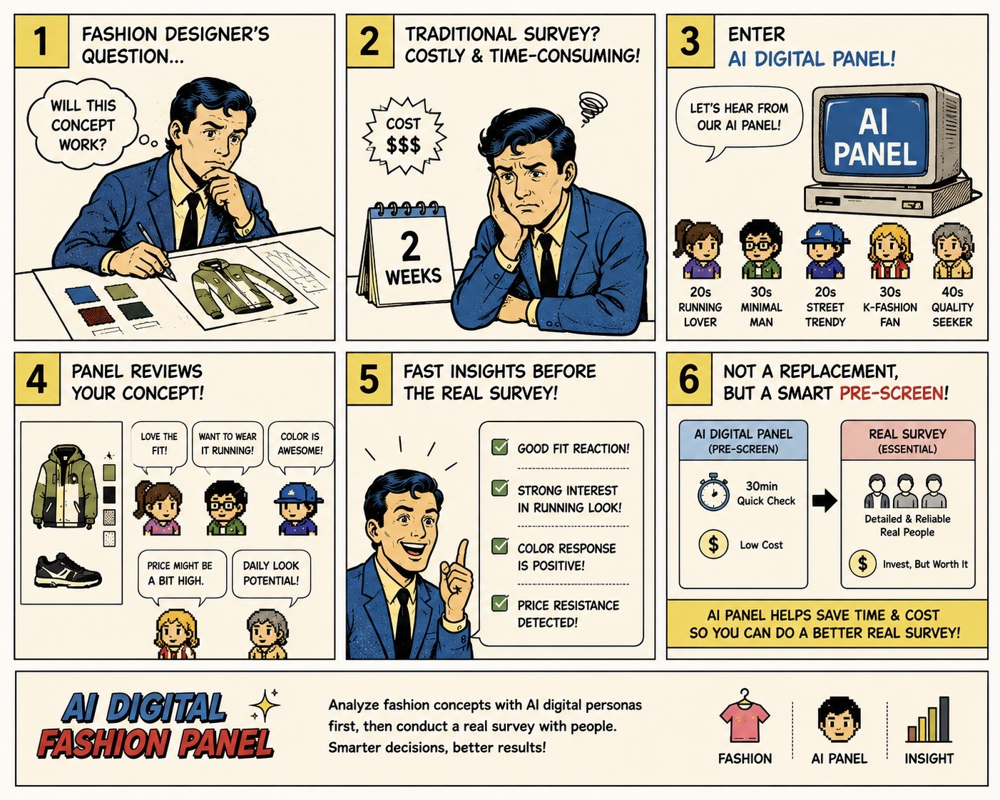
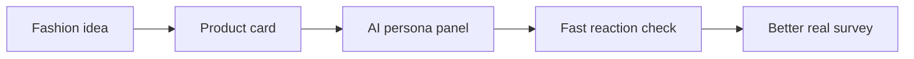

# usfashionpersona



## Check a US fashion idea before a real survey

[](https://huggingface.co/datasets/nvidia/Nemotron-Personas-USA)
[](https://github.com/woooya129-ai/us-fashion-persona)
[](INSTALL-ENG.md)
[](LICENSE)
[](https://www.linkedin.com/in/woody-kim-ab2741403/)

usfashionpersona is a local AI panel tool for fashion concept screening.

You enter a fashion product idea. The app shows it to synthetic personas with a US context. Then it gives early signals about fit, interest, hesitation, and risk.

This tool helps you prepare for a better real survey. It does not replace a real survey, real customer interviews, sales data, or expert review.



## What It Checks

- Product type, price, fit, material, and color
- Season and wearing situation
- Style tone and brand message
- Target customer idea
- Why a persona may like it
- Why a persona may hesitate
- Price resistance and fashion risk signals
- A Markdown or CSV report

## How It Works

1. You write a fashion concept in a product card.
2. The app loads synthetic personas from NVIDIA Nemotron-Personas-USA.
3. You can filter the panel by fields like age, gender, region, or job.
4. The app samples a persona panel with a seed.
5. An LLM checks the concept from each persona view.
6. The app validates the answers with a fixed JSON schema.
7. You read the result as a report.

## What The Result Means

Use the result as a pre-screen.

Good use:

- Find weak parts in the product story.
- Compare two early concept directions.
- Check if price, material, or fit may create friction.
- Prepare better questions for a real survey.

Bad use:

- Predict real sales.
- Predict real purchase rate.
- Replace a real consumer survey.
- Make a final launch decision from AI output only.

## Data

The main external dataset is [NVIDIA Nemotron-Personas-USA](https://huggingface.co/datasets/nvidia/Nemotron-Personas-USA).

The dataset is synthetic. It is not a list of real people. It gives persona-style context for early product thinking.

For price context, this app uses the BLS 2024 Consumer Expenditure `Apparel and services` yearly spend baseline. This is only a simple price-burden reference. It is not income, wealth, or purchase intent.

## Run Locally

This is not a hosted service. Run it on your own computer.

Requirements:

- Python 3.11 or higher
- uv
- Streamlit
- Your own LLM provider API key
- Hugging Face access if needed

```bash
git clone https://github.com/woooya129-ai/us-fashion-persona.git
cd us-fashion-persona
uv sync --all-extras --dev
uv run streamlit run src/app.py
```

Open `http://localhost:8501` in your browser.

For more setup steps, read [INSTALL-ENG.md](INSTALL-ENG.md).

## API Key And Local Data

- Enter your API key in the Streamlit password field.
- Do not commit API keys.
- API keys, cache files, outputs, logs, and raw data are not included in this public repository.
- Put local persona files under `data/`. The recommended folder is `data/raw/`.
- The app stores run metadata in a local SQLite cache.
- It does not store raw API keys, Hugging Face tokens, raw provider responses, or raw concept text as separate columns.

## License

- Code: GNU AGPL-3.0-only
- NVIDIA Nemotron-Personas-USA: see the dataset page for its license and attribution terms

Contact: woooya129 [at] gmail [dot] com
