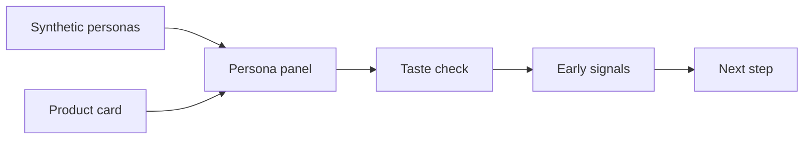

# usfashionpersona

## Check US fashion concepts

## with AI personas first

Enter a product card with category, price, fit, material, color, wearing context, and target hypothesis. The app checks taste fit, interest reasons, hesitation points, and fashion risk signals from synthetic persona-style reactions.

This is a local-first public beta tool for checking the direction of fashion concept reactions before a professional survey or main research study. It is not a real consumer prediction, purchase-rate prediction, or sales prediction service.

NVIDIA Nemotron-Personas-USA is a synthetic persona dataset with USA context. This tool shows a fashion product card to synthetic personas and helps you scan taste fit, interest reasons, hesitation points, and risk signals before a main survey.

This works as an early check because the goal is not to predict real buying behavior. The goal is to see which parts of the concept create interest and which parts may block the reaction. Final decisions should still use real surveys, sales data, and expert review.

## What You Can Check

- Product category, price range, fit, material, color
- Season, wearing context, style tone
- Brand message and product description
- Target and brand hypothesis
- Interest reasons, hesitation points, and risk signals by persona
- Result report download

## Boundary

- Runs locally with your own API key.
- The default API key flow is the password field in the Streamlit screen.
- API keys, cache, outputs, and raw data are not included in the public repository.
- Local persona files are read only under `data/`. The recommended location is `data/raw/`.
- NVIDIA Nemotron-Personas-USA is attributed under CC BY 4.0.
- The public code license is GNU AGPL-3.0-only.
