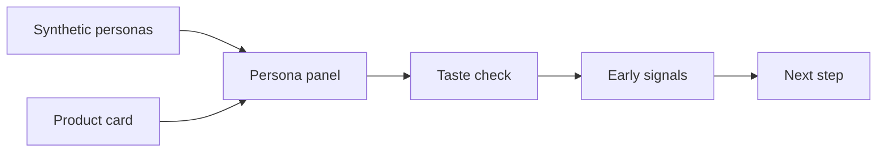

# us-fashion-persona

## 미국 패션 컨셉을 AI 페르소나로 먼저 점검

[](pyproject.toml)
[](https://huggingface.co/datasets/nvidia/Nemotron-Personas-USA)
[](https://github.com/woooya129-ai/us-fashion-persona)
[](https://github.com/woooya129-ai/k-fashion-persona)
[](docs/INSTALL.md)
[](README.md)
[](LICENSE)
[](CITATION.cff)
[](https://www.linkedin.com/in/woody-kim-ab2741403/)

us-fashion-persona는 미국 패션 제품 컨셉을 실제 출시나 공식 조사 전에
AI 합성 페르소나 관점으로 점검하는 local-first Streamlit 도구다.

한국 기준 쌍둥이 프로젝트는
[k-fashion-persona](https://github.com/woooya129-ai/k-fashion-persona)다.

제품 카드에 카테고리, 가격, 핏, 소재, 컬러, 시즌, 착용 상황, 스타일 톤,
브랜드 메시지, 타깃 가설을 넣으면 앱이 합성 페르소나 패널 기준으로 관심
이유, 망설임, 가격 부담, 핏 리스크, 소재 관리 부담, 코디 마찰, 착용 상황
불일치를 정리한다.

이 도구는 실제 소비자 반응, 구매율, 매출, 시장점유율, 유행을 예측하지 않는다.




## 주요 기능

- 미국 맥락의 합성 페르소나 패널 구성
- 제품 카드 기반 패션 컨셉 입력
- 연령, 성별, 주, 직업 필터
- seed 기반 샘플링
- OpenAI, Anthropic, Gemini provider/model 선택
- API key와 Hugging Face token의 화면 입력 또는 외부 `.env` 사용
- BLS, U.S. Census, Federal Reserve 공식 집계 통계 컨텍스트 사용
- Markdown, CSV 리포트 다운로드

## 데이터와 통계

기본 페르소나 데이터셋은
[NVIDIA Nemotron-Personas-USA](https://huggingface.co/datasets/nvidia/Nemotron-Personas-USA)다.
합성 페르소나 데이터셋이며 실제 사람 데이터가 아니다.

Hugging Face 공식 데이터셋 기준으로 pinned USA 데이터셋은 100만 레코드,
600만 페르소나 설명, UUID를 제외한 22개 필드, 2.69GB Parquet 파일로
제공된다. 앱 기본 모드는 Hugging Face `datasets` streaming 로딩을 사용하므로
전체 데이터셋을 한 번에 RAM에 올리지 않고, 로컬에서 필터링과 reservoir
sampling을 수행한다.

소득, 자산, 소비 통계는 개별 페르소나의 실제 경제 상태를 추정하지 않는다.
리포트와 프롬프트의 가격 맥락은 다음 미국 공식 집계값을 고정 기준으로 사용한다.

- BLS Consumer Expenditure Survey 2024: annual Apparel and services spending
- U.S. Census CPS ASEC 2024 income release: median household income
- Federal Reserve Survey of Consumer Finances 2022: median and mean family net worth

## 로컬 실행

```bash
git clone https://github.com/woooya129-ai/us-fashion-persona.git
cd us-fashion-persona
uv sync --all-extras --dev
uv run streamlit run src/app.py
```

브라우저에서 연다.

```text
http://localhost:8501
```

자세한 설치 절차는 [docs/INSTALL.md](docs/INSTALL.md)를 보면 된다.

## 라이선스와 고지

- 코드 라이선스: GNU AGPL-3.0-only, `LICENSE`
- 상용/듀얼 라이선스 안내: `LICENSE-COMMERCIAL.md`, `NOTICE`
- 제3자 고지: `docs/THIRD_PARTY_NOTICES.md`
- 브랜딩 안내: `docs/BRANDING_POLICY.md`
- NVIDIA Nemotron-Personas-USA: CC BY 4.0 attribution 대상

us-fashion-persona와 k-fashion-persona는 쌍둥이 프로젝트다. 공개 저장소는 같은
AGPL-3.0-only와 별도 상용/듀얼 라이선스 안내 구조를 사용한다.

상업적 폐쇄 도입, 사내 SaaS, 재배포 제품, AGPL 조건 적용이 어려운 사용은
저작권자와 별도 서면 상용 라이선스 조건을 협의해야 한다.

Contact: woooya129 [at] gmail [dot] com

### 출처와 방법론 인용

- 인용 형식: `CITATION.cff`
- 방법론과 권리 포지셔닝: `docs/METHODOLOGY_AND_RIGHTS.md`
- 이 저장소는 추상 아이디어 독점을 주장하지 않고, 공개 코드·문서·프롬프트·리포트 구조·브랜딩·상업 도입 계약의 경계를 명확히 둔다.
- 기업의 폐쇄형 제품, 사내 SaaS, 유료 컨설팅 워크플로, 공식 브랜딩 사용은 상용 라이선스 협의 대상이다.
