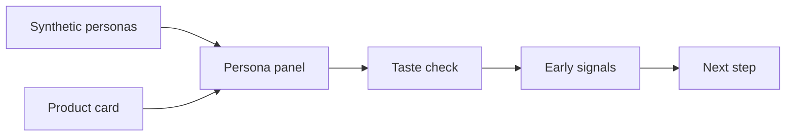

# us-fashion-persona


## 미국 패션 컨셉을 실제 조사 전에 AI 페르소나로 먼저 점검

[](https://huggingface.co/datasets/nvidia/Nemotron-Personas-USA)
[](https://github.com/woooya129-ai/us-fashion-persona)
[](https://github.com/woooya129-ai/k-fashion-persona)
[](INSTALL.md)
[](LICENSE)
[](https://www.linkedin.com/in/woody-kim-ab2741403/)

us-fashion-persona는 미국 기준의 패션 컨셉을 합성 페르소나 패널로 먼저 확인하는 로컬 AI 도구다.

한국 기준의 쌍둥이 프로젝트는 [k-fashion-persona](https://github.com/woooya129-ai/k-fashion-persona)다.

사용자는 패션 제품 아이디어를 입력한다. 앱은 NVIDIA Nemotron-Personas-USA 기반 합성 페르소나에게 제품 카드를 보여주고, 취향 적합성, 관심 이유, 망설임, 리스크 신호를 요약한다.

이 도구는 더 나은 실제 조사를 준비하기 위한 pre-screen이다. 실제 소비자 조사, 고객 인터뷰, 판매 데이터, 전문가 검토를 대신하지 않는다.




## 확인할 수 있는 것

- 제품 유형, 가격, 핏, 소재, 컬러
- 시즌과 착용 상황
- 스타일 톤과 브랜드 메시지
- 타깃 고객 가설
- 페르소나가 좋게 볼 수 있는 이유
- 페르소나가 망설일 수 있는 이유
- 가격 저항과 패션 리스크 신호
- Markdown 또는 CSV 리포트

## 작동 방식

1. 패션 컨셉을 제품 카드에 입력한다.
2. 앱이 NVIDIA Nemotron-Personas-USA 합성 페르소나를 불러온다.
3. 연령, 성별, 주, 직업 같은 필드로 패널을 필터링할 수 있다.
4. seed 기반 샘플링으로 페르소나 패널을 만든다.
5. LLM이 각 페르소나 관점에서 컨셉을 평가한다.
6. 결과는 고정 JSON 스키마로 검증된다.
7. Markdown 또는 CSV 리포트로 확인한다.

## 리포트 예시

아래는 Markdown 리포트의 축약 예시다. 수치는 README용 합성 예시이며, 실제 결과는 제품 카드, 페르소나 필터, provider/model, sampling seed에 따라 달라진다.

예시 입력:

- 카테고리: 여성용 경량 필드 재킷
- 가격: $189
- 소재: 생활 방수 코튼 블렌드
- 컬러: 올리브, 네이비
- 착용 상황: 출근, 주말 외출, 가벼운 여행
- 타깃 가설: 실용적인 데일리 아우터를 원하는 25세부터 39세 여성

```markdown
# us-fashion-persona 합성 패널 분석 리포트
> 주의: 방향성 참고용. 세그먼트 비교에는 부적합.

## 합성 패널 40명 기준 반응 분포

| 항목 | 값 |
|---|---|
| 긍정 반응 | 17명 / 42.5% |
| 중립 반응 | 16명 / 40.0% |
| 부정 반응 | 7명 / 17.5% |
| 평균 관심도 | 6.3 / 10 |
| 가격 부담도 high 이상 | 0명 / 0.0% |
| 파싱/API 실패 또는 제외 | 2명 |

## 가격 부담도 분포

| 라벨 | 명수 |
|---|---|
| low | 36명 |
| medium | 4명 |
| high | 0명 |
| very_high | 0명 |
| unknown | 0명 |

## 주요 긍정 이유

- 출근과 주말 캐주얼 착용에 모두 맞음 (8건)
- 올리브와 네이비 컬러가 데님, 블랙 기본 아이템과 맞추기 쉬움 (6건)
- 생활 방수 소재가 가벼운 여행에 실용적으로 보임 (5건)

## 주요 망설임 이유

- 핏과 사이즈 안내 사진 또는 치수가 더 필요함 (5건)
- 가격에 맞는 소재와 봉제 설명이 더 필요함 (4건)
- 세탁과 관리 방법이 충분히 명확하지 않음 (3건)

## 패션 위험 신호

| 카테고리 | 신호 수 | 대표 concern 예시 |
|---|---:|---|
| 가격 부담 | 4 | 가격에 대한 가치 설명이 더 필요함 |
| 핏 리스크 | 5 | 박시한 핏이 모든 체형에 맞지 않을 수 있음 |
| 소재/관리 부담 | 3 | 관리 방법이 불명확함 |
| 코디 어려움 | 2 | 올리브 컬러가 너무 유틸리티 느낌일 수 있음 |
| 착용 상황 불일치 | 1 | 일부 사무실에는 너무 캐주얼할 수 있음 |
| 구매 망설임 | 3 | 비슷한 재킷을 쉽게 찾을 수 있음 |
| 스타일 부담 | 2 | 디자인이 너무 기본적으로 보일 수 있음 |

## 수정 제안 후보

1. 체형별 착용 사진과 사이즈 가이드를 추가한다.
2. 원단 두께, 생활 방수, 안감 정보를 설명한다.
3. 오피스 캐주얼과 주말 여행 스타일링 예시를 보여준다.

## 대표 페르소나 반응

| 세그먼트 | 반응 | 관심도 | 대표 이유 |
|---|---|---:|---|
| 29세 / California / office worker | positive | 8 | 출근과 주말 착용 모두에 맞음 |
| 36세 / Texas / retail manager | neutral | 6 | 실용적이지만 가격 근거가 더 필요함 |
| 42세 / Illinois / self-employed | negative | 3 | 이미 가진 재킷과 비슷하게 느껴짐 |

---

이 리포트는 AI 합성 페르소나 기반 pre-screening 참고용이다.
실제 조사, 판매 데이터, 법률 자문, 최종 사업 판단을 대신하지 않는다.
Data source: NVIDIA Nemotron-Personas-USA.
```

CSV 리포트는 비슷한 내용을 `section,key,value` 컬럼으로 평면화한다.

```csv
section,key,value
반응분포,합성 패널 40명 기준 - 긍정,17명 / 42.5%
반응분포,평균 관심도,6.3 / 10
패션위험신호,핏 리스크,5건
수정제안,rank1_fit,체형별 착용 사진과 사이즈 가이드를 추가한다.
대표페르소나반응,rank1,29세 / California / office worker | positive | 관심도 8 | 출근과 주말 착용 모두에 맞음
```

## 결과를 해석하는 법

이 결과는 pre-screen으로 사용한다.

적합한 사용:

- 제품 설명에서 약한 부분 찾기
- 초기 컨셉 방향 A/B 비교
- 가격, 소재, 핏이 마찰을 만들 수 있는지 확인
- 실제 조사 질문을 더 잘 준비하기

부적합한 사용:

- 실제 판매 결과 예측
- 실제 구매 전환 추정
- 실제 소비자 조사 대체
- AI 결과만으로 최종 출시 결정

## 데이터

주요 외부 데이터셋은 [NVIDIA Nemotron-Personas-USA](https://huggingface.co/datasets/nvidia/Nemotron-Personas-USA)다.

이 데이터셋은 합성 데이터다. 실제 사람 목록이 아니다. 초기 제품 사고를 위한 페르소나식 맥락을 제공한다.

경제 맥락은 미국 공식 기준값 3개를 사용한다.

- BLS 2024 Consumer Expenditure `Apparel and services`: 연 $2,001
- Census CPS ASEC 2024 중위 가구소득: $83,730
- Federal Reserve SCF 2022 중위 family net worth: $192,900

이 값들은 가격 부담, 소득 맥락, 자산 맥락을 보기 위한 전국 기준값이다. 페르소나별 실제 소득, 자산, 구매력, 구매 의향이 아니다.

## 로컬 실행

이 프로젝트는 hosted service가 아니다. 자신의 컴퓨터에서 실행한다.

필요 조건:

- Python 3.11 이상
- uv
- Streamlit
- 사용자의 LLM provider API key
- 필요 시 Hugging Face 접근 권한

```bash
git clone https://github.com/woooya129-ai/us-fashion-persona.git
cd us-fashion-persona
uv sync --all-extras --dev
uv run streamlit run src/app.py
```

브라우저에서 `http://localhost:8501`을 연다.

자세한 설치 절차는 [INSTALL.md](INSTALL.md)를 보면 된다.

## API key와 로컬 데이터

- API key는 Streamlit password 입력칸에 넣는다.
- API key를 커밋하지 않는다.
- API key, cache, outputs, logs, raw data는 public repo에 포함하지 않는다.
- 로컬 페르소나 파일은 `data/` 아래에 둔다. 권장 위치는 `data/raw/`다.
- 앱은 실행 메타데이터를 로컬 SQLite cache에 저장한다.
- raw API key, Hugging Face token, raw provider response, raw concept text를 별도 컬럼으로 저장하지 않는다.

## 라이선스

- Code: GNU AGPL-3.0-only
- NVIDIA Nemotron-Personas-USA: dataset page의 license와 attribution 조건을 확인해야 한다.

Codex와 Claude Code를 함께 사용해 만들었습니다.

Contact: woooya129 [at] gmail [dot] com
