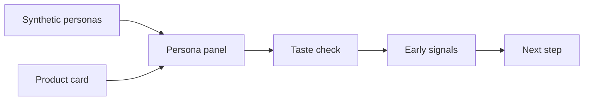

# us-fashion-persona


## Check a US fashion idea before a real survey

[](https://huggingface.co/datasets/nvidia/Nemotron-Personas-USA)
[](https://github.com/woooya129-ai/us-fashion-persona)
[](https://github.com/woooya129-ai/k-fashion-persona)
[](INSTALL-ENG.md)
[](LICENSE)
[](https://www.linkedin.com/in/woody-kim-ab2741403/)

us-fashion-persona is a local AI panel tool for fashion concept screening.

The twin Korea-context project is [k-fashion-persona](https://github.com/woooya129-ai/k-fashion-persona).

You enter a fashion product idea. The app shows it to synthetic personas with a US context. Then it gives early signals about fit, interest, hesitation, and risk.

This tool helps you prepare for a better real survey. It does not replace a real survey, real customer interviews, sales data, or expert review.




## What It Checks

- Product type, price, fit, material, and color
- Season and wearing situation
- Style tone and brand message
- Target customer idea
- Why a persona may like it
- Why a persona may hesitate
- Price resistance and fashion risk signals
- A Markdown or CSV report

## How It Works

1. You write a fashion concept in a product card.
2. The app loads synthetic personas from NVIDIA Nemotron-Personas-USA.
3. You can filter the panel by fields like age, gender, region, or job.
4. The app samples a persona panel with a seed.
5. An LLM checks the concept from each persona view.
6. The app validates the answers with a fixed JSON schema.
7. You read the result as a report.

## Report Example

This is a shortened example of a Markdown report. The numbers below are illustrative synthetic values. Real output changes with the product card, persona filters, provider/model, and sampling seed.

Example input:

- Category: women's lightweight field jacket
- Price: $189
- Material: water-resistant cotton blend
- Colors: olive, navy
- Wearing context: commute, weekend errands, light travel
- Target idea: women 25 to 39 who want practical daily outerwear

```markdown
# us-fashion-persona synthetic panel report
> Warning: Directional reference only. Not valid for segment comparison.

## Synthetic panel response distribution, n=40

| Metric | Value |
|---|---|
| Positive responses | 17 / 42.5% |
| Neutral responses | 16 / 40.0% |
| Negative responses | 7 / 17.5% |
| Average interest score | 6.3 / 10 |
| Price burden high or above | 0 / 0.0% |
| Parse/API failed or excluded | 2 |

## Price burden distribution

| Label | Count |
|---|---|
| low | 36 |
| medium | 4 |
| high | 0 |
| very_high | 0 |
| unknown | 0 |

## Main positive reasons

- Works for commute and weekend casual use (8)
- Olive and navy are easy to style with denim or black basics (6)
- Water-resistant fabric feels useful for light travel (5)

## Main hesitation reasons

- Fit and size guidance need clearer photos or measurements (5)
- The price needs material and construction proof (4)
- Care instructions are not clear enough (3)

## Fashion risk signals

| Category | Signals | Example concern |
|---|---:|---|
| Price burden | 4 | price needs stronger value proof |
| Fit risk | 5 | boxy fit may not work for all body types |
| Material/care burden | 3 | care instructions are unclear |
| Styling difficulty | 2 | olive color may feel too utility-like |
| Wearing context mismatch | 1 | may be too casual for some offices |
| Purchase hesitation | 3 | similar jackets are easy to find |
| Style burden | 2 | design may feel too basic |

## Candidate revisions

1. Add fit photos and a size guide for different body shapes.
2. Explain fabric weight, water resistance, and lining details.
3. Show two styling examples: office casual and weekend travel.

## Representative persona reactions

| Segment | Reaction | Interest | Main reason |
|---|---|---:|---|
| 29 / California / office worker | positive | 8 | commute and weekend use both fit |
| 36 / Texas / retail manager | neutral | 6 | practical, but price proof is needed |
| 42 / Illinois / self-employed | negative | 3 | too similar to jackets already owned |

---

This is an AI synthetic persona pre-screening report.
It does not replace real surveys, sales data, legal advice, or final business decisions.
Data source: NVIDIA Nemotron-Personas-USA.
```

CSV reports flatten similar content into `section,key,value` rows.

```csv
section,key,value
response_distribution,synthetic panel n=40 - positive,17 / 42.5%
response_distribution,average interest score,6.3 / 10
fashion_risk_signal,fit risk,5 signals
candidate_revision,rank1_fit,Add fit photos and a size guide for different body shapes.
representative_persona,rank1,29 / California / office worker | positive | interest 8 | commute and weekend use both fit
```

## What The Result Means

Use the result as a pre-screen.

Good use:

- Find weak parts in the product story.
- Compare two early concept directions.
- Check if price, material, or fit may create friction.
- Prepare better questions for a real survey.

Bad use:

- Predict real sales.
- Estimate real buying conversion.
- Replace a real consumer survey.
- Make a final launch decision from AI output only.

## Data

The main external dataset is [NVIDIA Nemotron-Personas-USA](https://huggingface.co/datasets/nvidia/Nemotron-Personas-USA).

The dataset is synthetic. It is not a list of real people. It gives persona-style context for early product thinking.

For economic context, this app uses three official U.S. baselines:

- BLS 2024 Consumer Expenditure `Apparel and services`: $2,001 per year
- Census CPS ASEC 2024 median household income: $83,730
- Federal Reserve SCF 2022 median family net worth: $192,900

These values help show price burden, income context, and asset context. They are national reference points only. They are not persona-specific income, wealth, purchasing power, or purchase intent.

## Run Locally

This is not a hosted service. Run it on your own computer.

Requirements:

- Python 3.11 or higher
- uv
- Streamlit
- Your own LLM provider API key
- Hugging Face access if needed

```bash
git clone https://github.com/woooya129-ai/us-fashion-persona.git
cd us-fashion-persona
uv sync --all-extras --dev
uv run streamlit run src/app.py
```

Open `http://localhost:8501` in your browser.

For more setup steps, read [INSTALL-ENG.md](INSTALL-ENG.md).

## API Key And Local Data

- Enter your API key in the Streamlit password field.
- Do not commit API keys.
- API keys, cache files, outputs, logs, and raw data are not included in this public repository.
- Put local persona files under `data/`. The recommended folder is `data/raw/`.
- The app stores run metadata in a local SQLite cache.
- It does not store raw API keys, Hugging Face tokens, raw provider responses, or raw concept text as separate columns.

## License

- Code: GNU AGPL-3.0-only
- NVIDIA Nemotron-Personas-USA: see the dataset page for its license and attribution terms

Built with Codex and Claude Code.

Contact: woooya129 [at] gmail [dot] com
