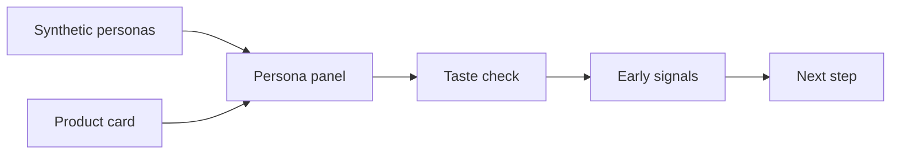
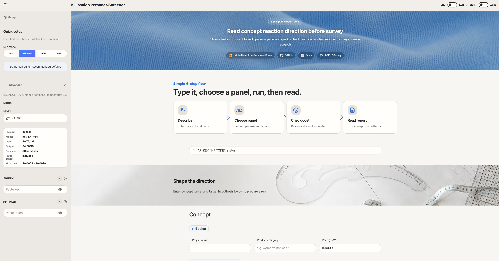
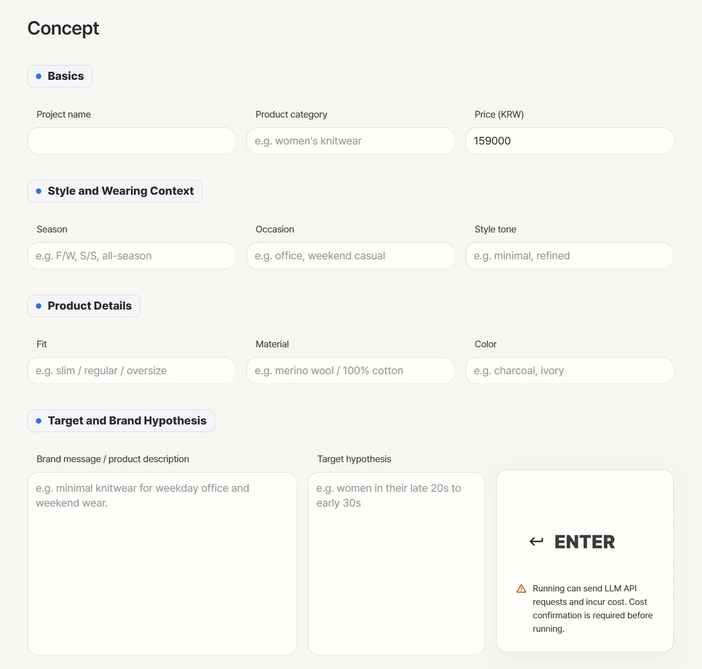

# us-fashion-persona

## Check US Fashion Concepts With AI Personas First

[](pyproject.toml)
[](https://huggingface.co/datasets/nvidia/Nemotron-Personas-USA)
[](https://github.com/woooya129-ai/us-fashion-persona)
[](https://github.com/woooya129-ai/k-fashion-persona)
[](docs/INSTALL-ENG.md)
[](README-KOR.md)
[](LICENSE)
[](CITATION.cff)
[](https://www.linkedin.com/in/woody-kim-ab2741403/)

us-fashion-persona is a local-first Streamlit tool for checking US fashion
product concepts with synthetic AI personas before launch or formal research.

The Korea-context twin project is
[k-fashion-persona](https://github.com/woooya129-ai/k-fashion-persona).

Enter a product card with category, price, fit, material, color, season,
wearing context, style tone, brand message, and target hypothesis. The app
scans interest reasons, hesitation points, price burden, fit risk, material
care burden, styling friction, and occasion mismatch.

This is not a real consumer prediction, purchase-rate prediction, sales
prediction, or market-share prediction service.







## What It Does

- Builds a synthetic persona panel with US context
- Accepts a product-card style fashion concept
- Filters by age, gender, region, and occupation
- Uses seed-based sampling
- Lets you choose LLM provider/model
- Accepts OpenAI, Anthropic, or Gemini API keys in the UI
- Accepts a Hugging Face token in the UI or external `.env`
- Uses BLS, U.S. Census, and Federal Reserve aggregate-statistics context
- Exports Markdown and CSV reports

## Data And Statistics

The default persona dataset is
[NVIDIA Nemotron-Personas-USA](https://huggingface.co/datasets/nvidia/Nemotron-Personas-USA).
It is a synthetic persona dataset, not real-person data.

According to the official Hugging Face dataset page, the pinned USA dataset
contains 1M records, 6M persona descriptions, 22 fields plus the UUID, and
2.69GB of Parquet files. The app's default mode uses Hugging Face `datasets`
streaming, so it does not load the full dataset into RAM at once. Filtering and
reservoir sampling run locally.

The app does not infer a persona's actual income, wealth, or purchasing power.
Report and prompt context use fixed aggregate statistics from official U.S.
sources:

- BLS Consumer Expenditure Survey 2024: annual Apparel and services spending
- U.S. Census CPS ASEC 2024 income release: median household income
- Federal Reserve Survey of Consumer Finances 2022: median and mean family net worth

These values are directional aggregate context only. Use real surveys, sales
data, and expert review for final decisions.

## Prompt Version And Optional Assets

- Default prompt: `prompts/concept_eval_ko_v0_3.md`
- Prompt contract: fixed JSON output schema with validation and retry handling
- Optional visual context: image URLs or file references can be included as
  product-card context, but no generated or uploaded image is bundled in this
  repository

## Runtime Architecture

v0.5.3 keeps the Streamlit entrypoint while separating small runtime seams:

- `src/app_config.py`: app metadata and project paths
- `src/orchestrator/`: dataset loading and sampling orchestration
- `src/ui/assets.py`: encoded UI asset loading
- `src/data_loader.py`: explicit Hugging Face token handling without mutating
  process environment state

## Quick Start

```bash
git clone https://github.com/woooya129-ai/us-fashion-persona.git
cd us-fashion-persona
uv sync --all-extras --dev
uv run streamlit run src/app.py
```

Open:

```text
http://localhost:8501
```

For full setup details, see [docs/INSTALL-ENG.md](docs/INSTALL-ENG.md).

## Local Checks

```bash
uv run ruff check .
uv run ruff format src tests --check
uv run pytest
uv run bandit -r src -c pyproject.toml
uv run pip-audit --skip-editable
uv run pre-commit run --all-files
```

Tests must not call real LLM providers or Hugging Face endpoints unless an
explicit integration-test path is approved by the maintainer.

## License And Notices

- Source license: GNU AGPL-3.0-only, see `LICENSE`
- Commercial and dual-license notice: `LICENSE-COMMERCIAL.md`, `NOTICE`
- Persona dataset: NVIDIA Nemotron-Personas-USA
- Dataset license: CC BY 4.0 attribution applies to the dataset provider
- Third-party notices: `docs/THIRD_PARTY_NOTICES.md`
- Branding policy: `docs/BRANDING_POLICY.md`

us-fashion-persona and k-fashion-persona are twin projects. They use the same
public AGPL-3.0-only and separate commercial/dual-license notice structure.

Commercial, closed-source, internal SaaS, redistributed-product, or other
non-AGPL use requires separate written commercial license terms from the
copyright holder.

Contact: woooya129 [at] gmail [dot] com

### Attribution And Methodology

- Citation format: `CITATION.cff`
- Methodology and rights positioning: `docs/METHODOLOGY_AND_RIGHTS.md`
- This repository does not claim ownership of an abstract idea. It separates
  public source code, documentation, prompts, report structure, branding, and
  commercial adoption terms.
- Closed-source products, internal SaaS, paid consulting workflows, and official
  branding use should be handled through commercial-license discussion.
