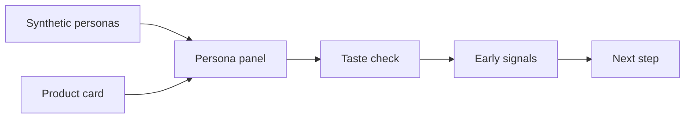
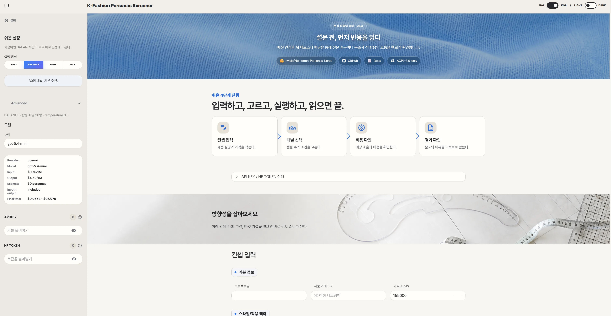
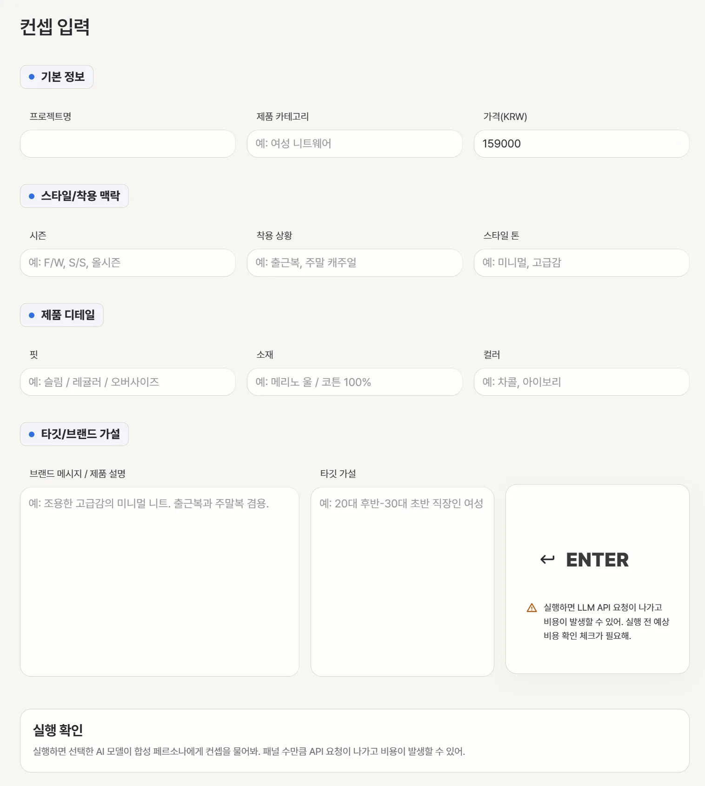

# usfashionpersona

## US fashion 컨셉을

## AI 페르소나로 먼저 점검

제품 카드에 카테고리, 가격, 핏, 소재, 컬러, 착용 맥락, 타깃 가설을 입력하고, 합성 페르소나 관점에서 취향 적합성, 관심 이유, 망설임, 패션 리스크 신호를 빠르게 확인합니다.

전문 설문이나 본조사 전에 패션 컨셉 반응의 방향성을 먼저 가늠하기 위한 local-first public beta 도구입니다. 실제 소비자 예측, 구매율 예측, 매출 예측 서비스가 아닙니다.

NVIDIA Nemotron-Personas-USA는 USA 맥락을 반영한 합성 페르소나 데이터셋입니다. 이 도구는 제품 카드를 여러 합성 페르소나에게 보여주는 방식으로, 본 설문조사 전에 취향 적합성, 관심 이유, 망설임, 리스크 신호를 빠르게 훑어봅니다.

이 방식이 가능한 이유는 실제 구매를 예측하려는 것이 아니라, 제품 설명을 봤을 때 어떤 지점에서 관심이 생기고 어떤 지점에서 막히는지 early signal을 보는 용도이기 때문입니다. 최종 판단은 실제 설문, 판매 데이터, 전문가 검토와 함께 해야 합니다.

## What You Can Check

- 제품 카테고리, 가격대, 핏, 소재, 컬러
- 시즌, 착용 상황, 스타일 톤
- 브랜드 메시지와 제품 설명
- 타깃/브랜드 가설
- 페르소나별 관심 이유, 망설임, 리스크 신호
- 결과 리포트 다운로드

## Boundary

- 사용자 본인의 API key로 로컬에서 실행합니다.
- 기본 API key 입력 방식은 Streamlit 화면의 password 입력칸입니다.
- API key, cache, outputs, raw data는 공개 저장소에 포함하지 않습니다.
- 로컬 persona 파일은 `data/` 하위에서만 읽습니다. 권장 위치는 `data/raw/`입니다.
- NVIDIA Nemotron-Personas-USA 데이터셋은 CC BY 4.0 attribution 대상입니다.
- 코드 공개 라이선스는 GNU AGPL-3.0-only입니다.
